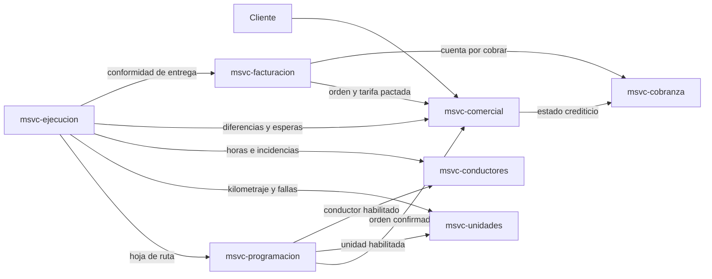

# Transportes El Mirador - Microservices

Sistema académico para gestionar las operaciones de **Transportes El Mirador S.A.C.**, una empresa dedicada al transporte terrestre de carga general. El proyecto aplica Domain-Driven Design (DDD) y una arquitectura de microservicios con Spring Boot.

## Estado del proyecto

La base técnica del Sprint 0 está operativa. El monorepo contiene siete aplicaciones Spring Boot independientes, un reactor Maven con Java 26, siete esquemas MySQL aislados, verificación automática en GitHub Actions y endpoints de salud. Los casos de uso, entidades y contratos HTTP de negocio se implementarán de forma incremental.

## Objetivo

Digitalizar el proceso completo de transporte de carga:

1. Registrar clientes, cotizaciones y órdenes de servicio.
2. Planificar viajes y consolidar cargas compatibles.
3. Asignar unidades y conductores habilitados.
4. Ejecutar y dar seguimiento a los viajes.
5. Registrar entregas, incidencias y liquidaciones.
6. Emitir facturas y administrar la cobranza.

Quedan fuera del alcance la mensajería, la paquetería, la carga refrigerada y el transporte de materiales peligrosos.

## Decisión arquitectónica principal

El proyecto mantiene una correspondencia **1:1 entre bounded context y microservicio**:

- 7 bounded contexts.
- 7 aplicaciones Spring Boot independientes.
- 7 bases de datos lógicamente independientes.
- Sin entidades JPA ni claves foráneas compartidas entre servicios.
- Integración inicial mediante HTTP síncrono con OpenFeign.

Un integrante puede liderar más de un microservicio, pero un microservicio no combina varios bounded contexts.

## Microservicios

| Microservicio | Bounded context | Responsabilidades principales | Puerto | Base de datos | Responsable |
|---|---|---|---:|---|---|
| `msvc-comercial` | Gestión Comercial | Clientes, cotizaciones, tarifarios, contratos marco y órdenes de servicio | `8010` | `mirador_comercial` | Sarah Herrera |
| `msvc-programacion` | Programación y Despacho | Viajes, consolidación, agendas, reservas, asignación de recursos y hojas de ruta | `8020` | `mirador_programacion` | Brayam Alfaro |
| `msvc-ejecucion` | Ejecución y Seguimiento | Checklist, hitos, paradas, incidencias, conformidades, gastos y liquidaciones | `8030` | `mirador_ejecucion` | Alexander Infante |
| `msvc-unidades` | Gestión de Unidades | Vehículos, documentos, mantenimiento, repuestos, kilometraje y estado operativo | `8040` | `mirador_unidades` | Arnold Ocas |
| `msvc-conductores` | Gestión de Conductores | Licencias, categorías, inducciones, horas de conducción y habilitación | `8050` | `mirador_conductores` | Brayam Alfaro |
| `msvc-facturacion` | Facturación | Facturas, líneas facturables, detracciones y notas de crédito | `8060` | `mirador_facturacion` | María Belén Vilca |
| `msvc-cobranza` | Cobranza | Cuentas por cobrar, pagos, aplicaciones y estado crediticio | `8070` | `mirador_cobranza` | María Belén Vilca |

`msvc-programacion` contiene el Core Domain. Su responsabilidad central es optimizar el uso de la flota mediante la consolidación de cargas y la asignación de recursos respetando las restricciones del negocio.

## Mapa de integraciones

Las flechas representan una llamada desde el consumidor hacia el servicio proveedor.



Las integraciones se implementarán con DTO específicos. Ningún servicio importará entidades o repositorios de otro módulo.

## Flujo principal

```text
Orden confirmada
      ↓
Viaje planificado
      ↓
Unidad y conductor reservados
      ↓
Checklist aprobado
      ↓
Viaje en ejecución
      ↓
Conformidad registrada
      ↓
Factura emitida
      ↓
Cuenta por cobrar y pago aplicado
```

Un viaje puede transportar varias órdenes de servicio. Cada orden mantiene su propia conformidad de entrega y genera su propia factura.

## Stack tecnológico

- Java 26.
- Spring Boot 4.1.0.
- Spring Cloud 2025.1.2.
- Maven Wrapper 3.9.16.
- Spring Web MVC.
- Spring Data JPA.
- Bean Validation.
- OpenFeign (sólo en los cuatro contextos que consumen a otro).
- Flyway 12.4.
- MySQL 8.4.
- Testcontainers 2.0.
- Spring Boot Actuator.
- JUnit.

Las versiones se centralizan en el `pom.xml` padre para que todos los módulos utilicen la misma configuración.

## Estructura del monorepo

```text
transportes-el-mirador-microservices/
├── pom.xml
├── mvnw
├── mvnw.cmd
├── .mvn/
├── .env.example
├── compose.yaml
├── docs/
│   ├── architecture/
│   ├── adr/
│   └── api/
├── msvc-comercial/
├── msvc-programacion/
├── msvc-ejecucion/
├── msvc-unidades/
├── msvc-conductores/
├── msvc-facturacion/
├── msvc-cobranza/
└── .github/
    └── workflows/
        └── ci.yml
```

Cada microservicio utiliza esta estructura básica:

```text
src/main/java/pe/edu/unc/elmirador/<contexto>/
├── controllers/
├── services/
├── repositories/
├── models/
│   ├── entity/          raíces de agregado y entidades hijas (JPA rico)
│   └── vo/              objetos de valor @Embeddable, con su lógica
├── dto/request/
├── dto/response/
├── clients/             sólo si el mapa de contexto da una flecha saliente
├── mappers/
├── exceptions/
└── config/

src/main/resources/
└── db/migration/        migraciones Flyway del esquema propio
```

El flujo interno será:

```text
HTTP → Controller → Service → Repository → MySQL
                         └──→ Feign Client → otro microservicio
```

## Reglas de persistencia e integración

- Cada microservicio es el único propietario de sus tablas.
- No se realizan consultas directas a la base de otro servicio.
- Las referencias externas se almacenan como identificadores, por ejemplo `ordenServicioId` o `unidadId`.
- Las transacciones solo abarcan la base local del microservicio.
- Las API utilizan DTO; las entidades JPA no se exponen como contratos HTTP.
- Las direcciones de los clientes Feign se configuran mediante variables de entorno.
- Las credenciales reales no se almacenan en el repositorio; los valores versionados son únicamente valores de desarrollo local.
- Los objetos de dominio compartidos conceptualmente conservan una implementación propia dentro de cada contexto.
- El esquema lo versiona Flyway dentro de cada módulo; Hibernate valida, nunca genera.
- Un microservicio sin flecha saliente en el mapa de contexto no incluye OpenFeign.

## Configuración local

Requisitos:

- JDK 26.
- Docker con Docker Compose.
- Git.

No es necesario instalar Maven: el repositorio incluye Maven Wrapper.

El archivo `.env.example` contiene valores exclusivos para desarrollo local. Cópialo antes de levantar MySQL:

```bash
cp .env.example .env
docker compose up -d
docker compose ps
```

Compose lee `.env` automáticamente. Spring Boot utiliza por defecto los mismos valores locales; si se personaliza el archivo, sus variables deben exportarse antes de ejecutar las aplicaciones:

```bash
set -a
. ./.env
set +a
```

La instancia MySQL se publica en `localhost:3307`, porque `3306` puede estar ocupado por otra instalación local. Dentro del contenedor continúa utilizando `3306`. Cada servicio se conecta con un usuario limitado a su propio esquema. Por ejemplo:

```dotenv
COMERCIAL_DB_URL="jdbc:mysql://localhost:3307/mirador_comercial?useSSL=false&allowPublicKeyRetrieval=true&serverTimezone=UTC"
COMERCIAL_DB_USER=mirador_comercial
COMERCIAL_DB_PASSWORD=comercial_dev_password

COMERCIAL_URL=http://localhost:8010
PROGRAMACION_URL=http://localhost:8020
EJECUCION_URL=http://localhost:8030
UNIDADES_URL=http://localhost:8040
CONDUCTORES_URL=http://localhost:8050
FACTURACION_URL=http://localhost:8060
COBRANZA_URL=http://localhost:8070
```

La lista completa de variables está en [`.env.example`](.env.example).

## Compilación y ejecución

Todo el monorepo se compila y prueba desde la raíz:

```bash
./mvnw clean verify
```

La infraestructura local se inicia con:

```bash
docker compose up -d
```

Cada aplicación se ejecuta de manera independiente:

```bash
./mvnw -pl msvc-comercial spring-boot:run
./mvnw -pl msvc-programacion spring-boot:run
./mvnw -pl msvc-ejecucion spring-boot:run
./mvnw -pl msvc-unidades spring-boot:run
./mvnw -pl msvc-conductores spring-boot:run
./mvnw -pl msvc-facturacion spring-boot:run
./mvnw -pl msvc-cobranza spring-boot:run
```

El estado de cada servicio se consulta mediante Actuator:

```text
http://localhost:<puerto>/actuator/health
```

Para comprobar en una sola operación que los siete JAR se conectan a MySQL y responden correctamente:

```bash
./scripts/smoke-test.sh
```

La comprobación utiliza temporalmente los puertos `18010` a `18070` y detiene los procesos al finalizar, por lo que no interfiere con aplicaciones que ya ocupen los puertos normales. El desplazamiento puede cambiarse mediante `SMOKE_PORT_OFFSET`.

## Documentación

- [Índice de documentación](docs/README.md).
- [Arquitectura y límites](docs/architecture/README.md).
- [Mapa de contextos](docs/architecture/context-map.md).
- [Despliegue local](docs/architecture/deployment.md).
- [Decisiones arquitectónicas](docs/adr/README.md).
- [Contratos de API](docs/api/README.md).
- [Guía de contribución](CONTRIBUTING.md).

## Estrategia Git

- `main` es la única rama permanente y debe mantenerse estable.
- Todo cambio se desarrolla en una rama corta creada desde `main`.
- Cada pull request requiere revisión cruzada y pruebas aprobadas.
- No se mantienen ramas permanentes por integrante ni por microservicio.
- Se utilizan Conventional Commits.

Ejemplos de ramas:

```text
feat/programacion/consolidar-ordenes
feat/conductores/validar-induccion
feat/facturacion/emitir-factura
fix/cobranza/calcular-dias-atraso
chore/compose-mysql
```

Ejemplos de commits:

```text
feat(programacion): implementa reserva de unidad
fix(cobranza): corrige cálculo de días de atraso
test(ejecucion): agrega pruebas del checklist de salida
```

## Plan de implementación

### Sprint 0: base técnica

- [x] Crear el POM padre y los siete módulos Maven.
- [x] Configurar un Maven Wrapper en la raíz.
- [x] Configurar las siete bases de datos.
- [x] Incorporar `compose.yaml` y `.env.example`.
- [x] Añadir Actuator a todos los servicios.
- [x] Definir los contratos entre microservicios ([docs/api/contracts.md](docs/api/contracts.md)).
- [x] Configurar integración continua en GitHub Actions.
- [x] Verificar que los siete servicios compilen.
- [x] Verificar el mapeo JPA contra MySQL real en CI (Testcontainers).
- [x] Versionar el esquema con Flyway (`ddl-auto=validate`).
- [ ] Verificar en CI que los siete arrancan (`smoke-test.sh` todavía es manual).

### Primer flujo vertical

- [ ] Registrar un cliente y confirmar una orden de servicio.
- [ ] Registrar una unidad y un conductor habilitados.
- [ ] Planificar un viaje y reservar sus recursos.
- [ ] Aprobar el checklist e iniciar la ejecución.
- [ ] Registrar la conformidad de entrega.
- [ ] Emitir la factura correspondiente.
- [ ] Crear la cuenta por cobrar y aplicar un pago.

### Reglas avanzadas

- [ ] Consolidación de cargas compatibles.
- [ ] Contratos marco y tarifarios versionados.
- [ ] Mantenimiento preventivo y vencimiento de documentos.
- [ ] Incidencias, transbordos y entregas parciales.
- [ ] Detracciones y notas de crédito.
- [ ] Suspensión y restablecimiento del crédito.
- [ ] Rentabilidad por viaje y por orden de servicio.

## Equipo

- Brayam Esmith Alfaro Urtecho.
- Sarah Daniela Fernanda Herrera Arias.
- Alexander Infante Chacón.
- Arnold Michell Ocas Ruiz.
- María Belén Vilca Ocas.

Universidad Nacional de Cajamarca<br>
Facultad de Ingeniería<br>
Escuela Profesional de Ingeniería de Sistemas<br>
Curso: Ingeniería de Software II

## Uso académico

Este repositorio se desarrolla con fines académicos como aplicación práctica de DDD, diseño táctico e integración de microservicios.
