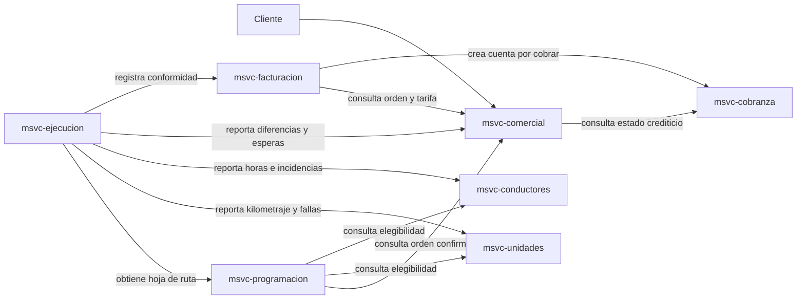

# Mapa de integraciones

Las flechas representan una solicitud desde el consumidor hacia el proveedor. La integración inicial será HTTP síncrona mediante OpenFeign.

## Dependencias permitidas

| Consumidor | Proveedor | Información |
|---|---|---|
| Programación | Comercial | Orden confirmada, carga, ruta y condiciones de consolidación |
| Programación | Unidades | Capacidad, estado operativo, documentos y mantenimiento |
| Programación | Conductores | Licencia, categoría, inducciones y horas disponibles |
| Ejecución | Programación | Viaje, asignaciones, paradas y hoja de ruta |
| Ejecución | Unidades | Actualización de kilometraje y reporte de fallas |
| Ejecución | Conductores | Horas conducidas e incidencias atribuibles |
| Ejecución | Comercial | Diferencias de carga, esperas y reclamos |
| Ejecución | Facturación | Conformidad y conceptos medidos durante el viaje |
| Facturación | Comercial | Tarifa y condiciones pactadas en la orden |
| Facturación | Cobranza | Factura emitida y detracción |
| Comercial | Cobranza | Estado crediticio del cliente |

La lista define relaciones autorizadas, no endpoints terminados. Los contratos concretos se incorporarán en `docs/api/openapi/` al implementar cada caso de uso.
